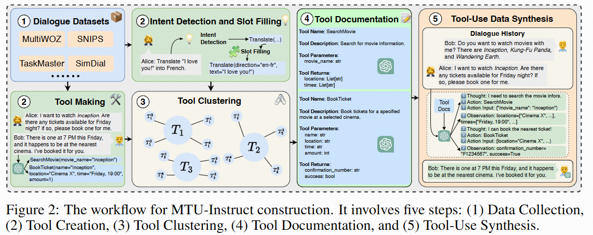
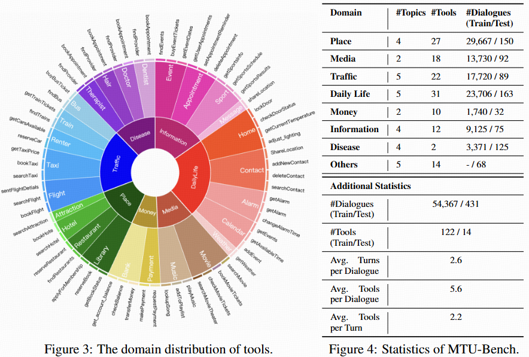
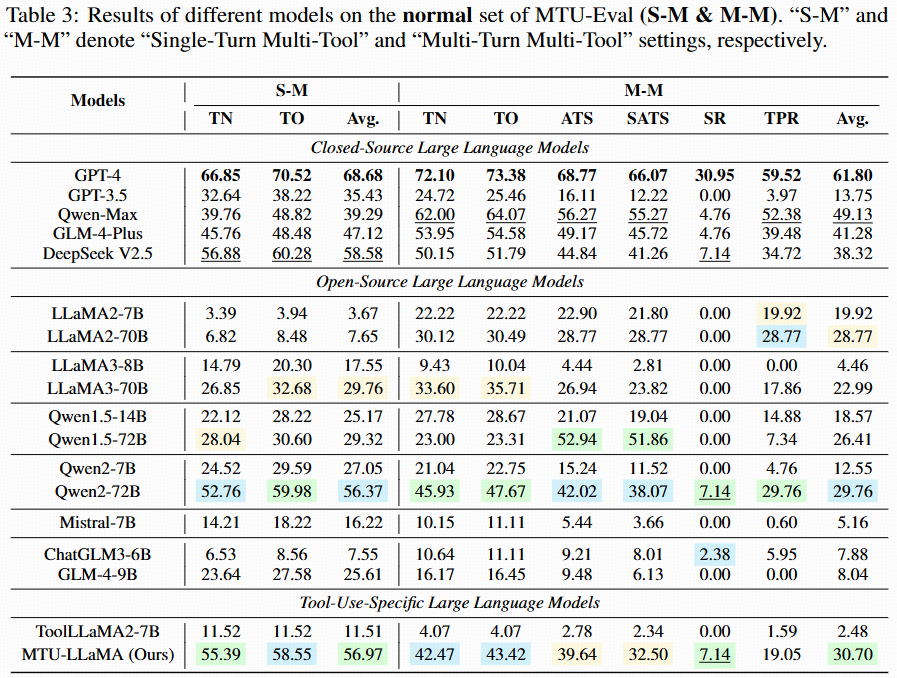
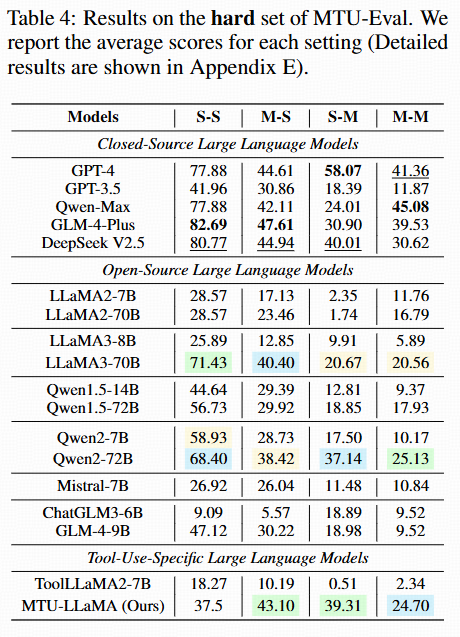
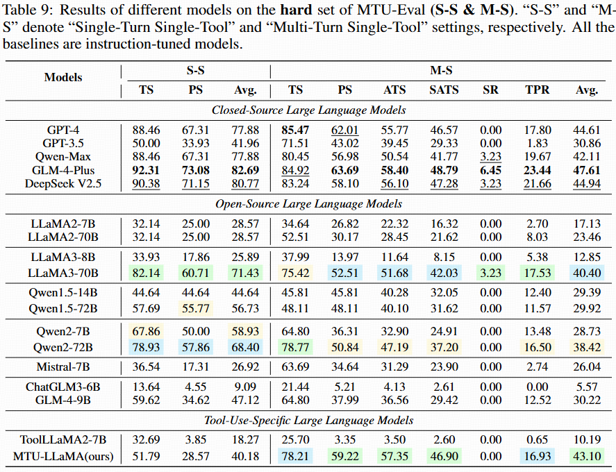
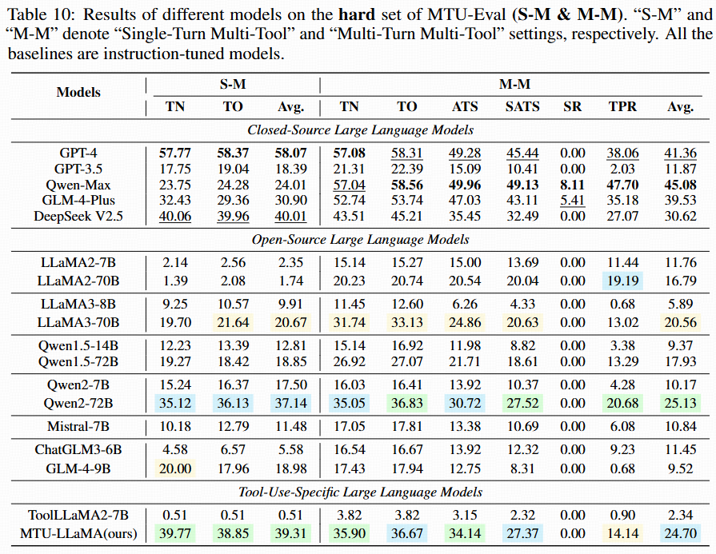
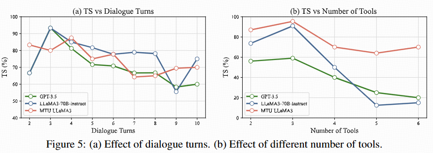
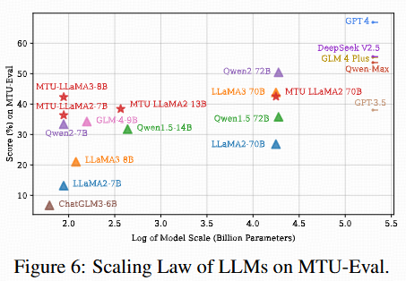
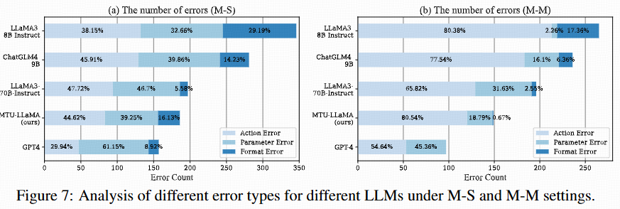

<div align= "center">
  
    <h1>MTU-Bench</h1>
</div>

<p align="center">  
MTU-Bench: A Multi-Granularity Tool-Use Benchmark for Large Language Models
</p>


<p align="center">
<a href="https://arxiv.org/abs/2410.11710">
  
</a>
<a href="https://huggingface.co/datasets/wpei/MTU-Bench">
  
</a>
<a href="https://github.com/MTU-Bench-Team/MTU-Bench">
  
</a>
<a href="https://mtu-bench.github.io">
  
</a>
</p>



## Abstract

Large Language Models (LLMs) have displayed massive improvements in reason- ing and decision-making skills and can hold natural conversations with users. Recently, many tool-use benchmark datasets have been proposed. However, existing datasets have the following limitations: (1). Insufficient evaluation scenarios (e.g., only cover limited tool-use scenes). (2). Extensive evaluation costs (e.g., GPT API costs). To address these limitations, in this work, we propose a multi-granularity tool-use benchmark for large language models called MTU-Bench. For the "multi-granularity" property, our MTU-Bench covers five tool usage scenes (i.e., single-turn and single-tool, single-turn and multiple-tool, multiple-turn and single-tool, multiple-turn and multiple-tool, and out-of-distribution tasks). Besides, all evaluation metrics of our MTU-Bench are based on the prediction results and the ground truth without using any GPT or human evaluation metrics. Moreover, our MTU-Bench is collected by transforming existing high-quality datasets to simulate real-world tool usage scenarios, and we also propose an instruction dataset called MTU-Instruct data to enhance the tool-use abilities of existing LLMs. Comprehensive experimental results demonstrate the effectiveness of our MTU-Bench.


## What's New

- **[2024/10/15]** We initialize the project page for MTU-Bench.


## MTU-Bench Statistics




## MTU-Instruct & MTU-Eval


MTU-Bench comprises both **MTU-Instruct** for training and **MTU-Eval** for evaluation. 
We sample **real-world** user instructions from various existing open-source
dialogue datasets such as MultiWOZ and SGD. After instruction clustering, the detected user intents and slot filling are leveraged to synthesize API calls using GPT-4. The synthesized data includes the thoughts, the actions (i.e., tool names), the action parameters, and the observations (i.e., the generated API execution results). This data forms our MTU-Bench dataset. Following meticulous quality verification by GPT-4 and manual check, we split the MTU-Bench data into training and testing splits, involving **54,798 dialogues** in total, as well as **136 tools**. In our **MTU-Eval**, we propose a series of fine-grained metrics such as **tool selection accuracy**, **parameter selection accuracy**, **success rate**, **turn success rate**, **task process rate**, **tool number accuracy**, **tool order accuracy**, etc., to evaluate the tool-use abilities in a comprehensive manner, where the GPT API costs are **not** needed for evaluation. Moreover, we also pick out a **hard subset** from the test split to include more complex tool-use scenarios such as easily confusable tools, nonsensical or noisy tools, tool parameter updating, etc.

## Experimental Results

### Results on Normal Set




### Results on Hard Set




### Ablation Studies and Analysis






## Star History

[](https://star-history.com/#MTU-Bench-Team/MTU-Bench&Date)

## Citation

Feel free to cite us if you like our work.

```bibtex
@inproceedings{Wang2024mtubench,
  title  = {MTU-Bench: A Multi-granularity Tool-Use Benchmark for Large Language Models},
  author = {Pei Wang and Yanan Wu and Noah Wang and Jiaheng Liu and Xiaoshuai Song and Z.Y. Peng and Ken Deng and Chenchen Zhang and JiakaiWang and Junran Peng and Ge Zhang and Hangyu Guo and Zhaoxiang Zhang and Wenbo Su and Bo Zheng},
  year   = {2024},
  url    = {https://openreview.net/forum?id=6guG2OlXsr&referrer=%5BAuthor%20Console%5D(%2Fgroup%3Fid%3DICLR.cc%2F2025%2FConference%2FAuthors%23your-submissions)}
}
```
